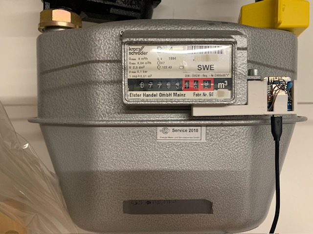

# gaszaehler

ESP8266 D1Mini

Verkabelung:

3V --[Wiederstand]--D7--/Reed-Kontakt\--GND

D7--|Kondensator|--GND

Infos:
Das Zaehlen der Umdrehungen des Zaehlers erfolgt mit einem Reed Kontakt.
Da es bisher ein Problem mit Prellen bestand musste der Zaehlerstand manuell angepasst werden.
Deshalb gibt es dazu ein eingabe Feld zur Korrektur. 

[[Bilder/Flow_GasZaehler.png]]